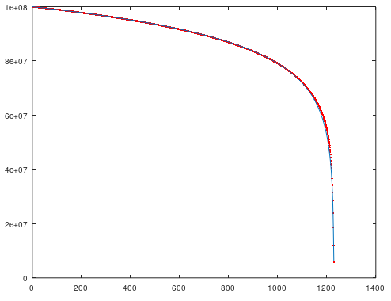

#### SieveMain.java的说明

筛法是研究素数分布的常用工具。

SieveMain.java这个程序，把 \([2, N]\) 的整数用各个素数都筛一遍，从而得到“满足条件”的解。

目前，程序设置了一个开关变量<code>flag</code>，当<code>flag</code>是1时，计算的是素数的分布，当<code>flag</code>是2时，计算的是哥德巴赫猜想的解的分布（即，给定\(N\)，求\(x\)，使得“\(x\)”和“\(N-x\)”都是素数）。

##### 算法说明

以<code>flag</code>等于1时为例，说明算法。

<code>list</code>中最开始是 \([2, N]\) 的整数，在循环中，用不同的素数\(p\)去筛选它们（去掉所有的\(p\)的倍数）。根据筛法原理，只要把 \([2, \sqrt{N}]\)的素数都筛过，剩下的就只可能是素数（注意 \([2, \sqrt{N}]\) 之间的素数被筛掉了）。

在循环的过程中，除了用素数\(p\)来筛这些数，也会计算一个<code>estimation</code>，来估计筛选的结果的数量。在这个过程中，可以对比实际结果和<code>estimation</code>之间的相对误差。

##### 如何估算

<code>list</code>的当前大小是\(size_n\)，经过素数\(p\)筛过之后的大小是\(size_{n+1}\)，那么\(size_n\)和\(size_{n+1}\)的关系是怎样？

一个简单粗暴的回答是，\(size_{n+1} \approx \left(1-\frac{1}{p}\right)size_n\)。这里的“依据”是，一个“随机数”是\(p\)的倍数的概率应该是\(\frac{1}{p}\)。

据此，可以用以下公式来估算筛选后结果的数量 $$ \left(N-1\right) \prod_{p=2}^{\sqrt{N}}\left(1-\frac{1}{p}\right) $$

##### 误差分析

根据素数定理，\([2, N]\)之间的素数数量约为\(\int_{0}^{N}\frac{\mathrm{d}x}{\log x}\)，或近似表示为\(\frac{N}{\log N}\)

根据梅滕斯第三定理，$$\lim_{n\to\infty}\log n \prod_{p \le n}\left(1-\frac{1}{p}\right)=e^{-\lambda}\approx 0.56145948$$ 其中\(\lambda\)是欧拉-马斯克若尼常数，\(\lambda\approx 0.57721566\)。
因此，$$\left(N-1\right) \prod_{p=2}^{\sqrt{N}}\left(1-\frac{1}{p}\right) \sim \frac{2 e^{\lambda} N}{\log N}$$

如果我们忽略 \([2, \sqrt{N}]\) 之间的素数对结果数量的影响（当\(N\)很大时，它们可以忽略不记），则可以预计，当\(N \to \infty\)时，相对误差应该是\(2 e^{-\lambda}-1\approx 12.29\%\)。

##### 图形对比

把 \([2, \sqrt{N}]\) 的素数，由大到小排序，然后一个一个用这些素数去筛 \([2, \sqrt{N}]\) 的整数。

\(N=10^8\) 时的情形

实际每次筛去的数量，对比预测的数量：

相对误差：

实际每次筛后剩下的数量，对比预测的数量：

相对误差：

以下是<code>flag == 2</code>时的图形

相对误差：

实际每次筛后剩下的数量，对比预测的数量：

相对误差：

这些图形之间，有着明显的规律。比如“剩余数量的相对误差”图形，形状几乎一模一样。

下面画出“相对误差的X-Y图”（横轴是<code>flag == 1</code>的情况，纵轴是<code>flag == 2</code>的情况）

上图中的蓝线是线性回归得到的结果，\(y=k\;x + b\)，其中\(k\approx 1.95068\)，\(b\approx -1.584 \times 10^{-5}\)。

